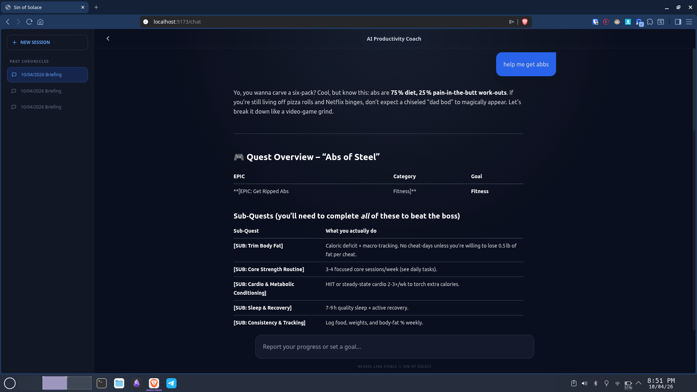
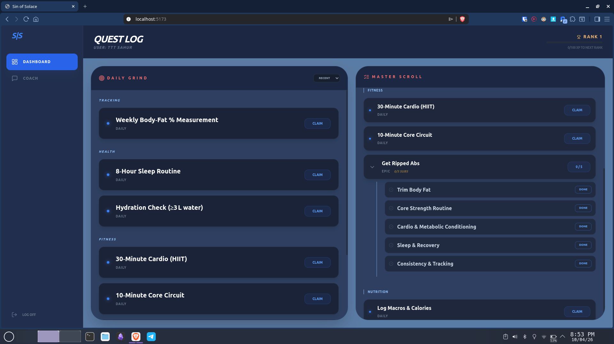

# This is 


### commands to run this project 

no the npm install and .env then

```
cd backend
# npx tsx src/server.ts # not needed
npm run dev
```

```
cd frontend
npm run dev
```

### video demo

[](https://youtu.be/UO4M5LfoHkI)


### images


